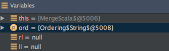
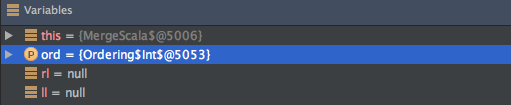

# Implicit
이글은 스칼라의 Implicit 대하여 설명한 글이며, coursera의 스칼라 프로그래밍 강의와 Programming in Scala 2th Edtion 책을 참조하여 작성하였습니다.

## Normal MergeSort

스칼라를 이용해서 숫자 배열을 정렬하는 MergeSort를 구현해 보도록 하겠습니다.

먼저 완성된 코드는 아래와 같습니다.

```scala
def mSort(l : List[Int]): List[Int] ={
    val n = l.length / 2
    if(n == 0) l
    else{
      def merge(ll : List[Int] , rl : List[Int]) : List[Int] = (ll , rl)  match{
        case (Nil , rl) => rl
        case(ll , Nil) => ll
        case(l :: ll1 , r :: rl1) =>
          if(l < r) l :: merge(ll1 , rl)
          else r :: merge(ll , rl1)
      }
      val(fst , snd) = l splitAt n
      merge(mSort(fst) , mSort(snd))
    }
````
 java로 구현된 merge sort와 조금 다른 부분은 merge 하는 부분인데요...

 조금 자세히 알아보도록 하겠습니다.

 ```scala
      def merge(ll : List[Int] , rl : List[Int]) : List[Int] = (ll , rl)  match{
        case (Nil , rl) => rl
        case(ll , Nil) => ll
        case(l :: ll1 , r :: rl1) =>
          if(l < r) l :: merge(ll1 , rl)
          else r :: merge(ll , rl1)
      } 
 ```

merge 함수에 전달된 ll과 rl은 이미 정렬되어 있는 상태 입니다.

전달 된 두 배열 중 첫번째 값을 비교하여 , 작은 숫자를 배열에 앞쪽으로 위치하게 하고 

다시 merge 함수를 호출할 때는 앞쪽으로 위치 시킨 숫자를 제외한 배열을 다시 넘기게 됩니다.

이 작업을 함수를 재귀적으로 호출하여 수행하게 됩니다.

혹시, 숫자만 정렬하는 merge sort를 문자도 정렬 할 수 있는 merge sort로 변경하려면 어떻게 해야 할까요..?? 

.

.

.

다양한 방법이 있겠지만, 함수형 언어를 배우고 있는 만큼 함수를 파라미터로 전달 받는 merge sort를

구현해 보도록 하겠습니다.

## Various Type MergeSort

```scala
  def mSort2[T](l : List[T])(lt : (T,T) => Boolean): List[T] ={
    val n = l.length / 2
    if(n == 0) l
    else{
      def merge(ll : List[T] , rl : List[T]) : List[T] = (ll , rl)  match{
        case (Nil , rl) => rl
        case(ll , Nil) => ll
        case(l :: ll1 , r :: rl1) =>
          if(lt(l , r)) l :: merge(ll1 , rl)
          else r :: merge(ll , rl1)
      }
      val(fst , snd) = l splitAt n
      merge(mSort2(fst)(lt) , mSort2(snd)(lt))
    }
  }
```

이전 코드와 거의 유사하지만 , 두 원소간의 대/소를 비교하는 함수를 전달 받고 다양한 타입을

파라미터로 전달 받을 수 있도록 수정 했습니다.

이제, 아래와 같이 String 배열도 정렬 할 수 있게 되었습니다.

```scala
val strs = List("1" , "5" , "3" , "2")
mSort2(strs)((x:String,y:String) => x.compareTo(y) < 0)
```

두개의 String을 입력받아 두 문자열간의 대/소 관계를 리턴하는 함수를 mSort2의 파라미터로 전달 하였습니다.

스칼라는 똑똑하기(?) 때문에 아래와 같이 currying 형태로 전달되는 함수의 파라미터를 생략해도 정상적으로 동작 합니다. 

```scala
mSort2(strs)((x,y) => x.compareTo(y) < 0)
```

## MergeSort With Ordering

스칼라에서는 Ordering이라는 type을 제공합니다.(type에 대해서는 다음 기회에 자세히 알아보도록

하겠습니다.) Ordering을 사용하기 위해 merge sort 코드를 아래와 같이 수정합니다.

```scala
  def mSort3[T](l : List[T])(ord:Ordering[T]): List[T] ={
    val n = l.length / 2
    if(n == 0) l
    else{
      def merge(ll : List[T] , rl : List[T]) : List[T] = (ll , rl)  match{
        case (Nil , rl) => rl
        case(ll , Nil) => ll
        case(l :: ll1 , r :: rl1) =>
          if(ord.lt(l , r)) l :: merge(ll1 , rl)
          else r :: merge(ll , rl1)
      }
      val(fst , snd) = l splitAt n
      merge(mSort3(fst)(ord) , mSort3(snd)(ord))
    }
  }

mSort3(List("1" , "5" , "3" , "2"))(Ordering.String)  
```

String의 대/소를 비교하는 함수를 작성하지 않아도 위와 같이 정렬을 할 수 있게 되었습니다.

## Implicit Parameter

merge sort 함수의 파라미터에 implicit 키워드를 아래와 같이 추가해보도록 하겠습니다.

```scala
  def mSort4[T](l : List[T])(implicit ord:Ordering[T]): List[T] ={
    val n = l.length / 2
    if(n == 0) l
    else{
      def merge(ll : List[T] , rl : List[T]) : List[T] = (ll , rl)  match{
        case (Nil , rl) => rl
        case(ll , Nil) => ll
        case(l :: ll1 , r :: rl1) =>
          if(ord.lt(l , r)) l :: merge(ll1 , rl)
          else r :: merge(ll , rl1)
      }
      val(fst , snd) = l splitAt n
      merge(mSort4(fst) , mSort4(snd))
    }
  }


  mSort4(List("1" , "5" , "3" , "2"))
  mSort4(List(-1 , 10 , 2 , 4))
```

mSort4 호출시에는 Ordering type을 전달하지 않고 List만 파라미터로 사용 하였습니다.

무슨일이 벌어진걸까요?? 좀 더 자세히 알아보기 위해 디버깅을 해보았습니다.

mSort4 호출시 전달된 ord 객체는 아래 그림과 같습니다.





위의 그림에서 볼 수 있듯이 , 스칼라가 전달된 타입에 맞는 Ordering Type을 파라미터로 전달 했습니다.

조금 더 자세히 알아보도록 하겠습니다.

먼저 , 숫자를 입력받아 화면에 출력하는 간단한 예제를 만들어 보도록 하겠습니다.

```scala

def normalPrint(i:Int) : Unit = {
    print(i)
  }

def implicitPrint(implicit i:Int) : Unit = {
    print(i)
}

implicitPrint(30) // 30

implicitPrint //  error
```

implicitPrint 함수에 30을 파라미터로 넘겨주면 정상적으로 30이 출력 됩니다.

하지만 아무값도 넘겨주지 않으면 , 아래와 같은 오류가 발생합니다.

  error: could not find implicit value for parameter i: Int

이번엔 아래와같이 implicit 변수를 선언하고 implicitPrint 함수를 호출 해보겠습니다. 

```scala
implicit val a = 10
implicitPrint // 10
```    

정상적으로 10이 화면에 출력 되는 것을 확인 할 수 있습니다.

정리해보면..

implicit 타입으로 선언된 파라미터가 있는 함수 호출 시, 파라미터를 생략하면

스칼라 컴파일러가 implicit로 선언된 변수 중 적당한(?) 값을 넘겨줍니다.

이것을 implicit parameter라고 합니다.^^

지금까지 implicit parameter에 대하여 알아보았습니다.

다음은 implicit conversions 대하여 알아보도록 하겠습니다.

## Implicit Conversions

SWT로 개발을 해본 개발자 분이라면 아래 코드가 익숙 할 것 입니다.

```java
Button button = new Button(shell, SWT.NONE);    
    button.addListener(SWT.Selection, new Listener() {
      public void handleEvent(Event e) {
        switch (e.type) {
        case SWT.Selection:
          System.out.println("Button pressed");
          break;
        }
      }
    });
``` 
Button에 event를 등록하는 코드입니다. 화면에서 버튼 클릭시 동작하는 코드는

Listener Interface에 handleEvent이지만, 버튼에 이벤트를 등록 하기 위해서는

위와 같이 Listener 인터페이스 구현하는 코드를 작성해야 합니다. 꽤나 귀찮은 작업입니다..

(물론 ide가 대부분의 코드를 만들어 주기 때문에 , 실제 개발자가 작성하는 부분은 많지 않습니다.^^)

실제 동작하는 함수만 작성하는 방법은 없을까..?? 스칼라 코드로 위의 코드를 바꿔보도록 하겠습니다.

```scala
class Button{

  var listener:EventListener = null;

  def addEventListener(listener:EventListener): Unit ={
    this.listener = listener
  }

  def Click() : Unit = {
    println(listener.clicked)
  }

}

trait EventListener{
  def clicked: Unit
}

```

위에 스칼라로 작성한 Button 클래스 입니다. 실제 Button 클래스와 동일하지는 않지만 Click 이벤트가

발생하면 등록된 EventLister의 clicked 이벤트가 호출 되도록 작성하였습니다.

먼저 java 코드와 동일하게 EventListener를 생성하여 Listener로 등록하는 코드를 작성해 보겠습니다.

```scala
val bt = new Button

bt.addEventListener(new EventListener {
  override def clicked: Unit = println("A")
})

bt.Click // "A"
```

Button 클래스를 생성하고 이벤트를 등록 후 Click 메서드를 실행 시켰습니다.

하지만..

우리는 스칼라 프로그래머!!

함수를 파라미터로 넘겨 EventListner 객체를 리턴하는 함수를 만들 수 있습니다.

```scala
def makeEventListener(f : () => Unit) : EventListener = {
  new EventListener{
  override def clicked: Unit = f()
  }
}

bt.addEventListener(makeEventListener(() => println("I'm Scala")))

bt.Click // I'm Scala
```

스칼라스러운 코드 이지만..

그래도 뭔가 부족하다면..implicit를 이용해 보겠습니다.

```scala
implicit def makeEventListener(f : () => Unit) : EventListener = {
  new EventListener{
  override def clicked: Unit = f()
  }
}

bt.addEventListener(
  () => {println("I'm Implicit")}
)

bt.Click //I'm Implicit 
```

위의 코드는 아래와 같은 순서로 실행 됩니다.

- 코드 컴파일
- 타입 오류 발생
- 암시적 변환(implicit conversion) 가능 여부 확인
- 변환 시도(makeEventListener)

이것이 스칼라의 implict conversion(암시적 변환)입니다.^^

지금까지 implicit conversion에 대하여 이야기해 보았습니다.

이제 마지막으로, view bounds에 대하여 알아보도록 하겠습니다.

## View Bounds

객체간의 대/소 관계를 비교하는 '>' 메소드를 가진 trait와 이를 상속하는

Person Class를 선언해 보도록 하겠습니다.

```scala
trait Ord[T]{
  def >(a:Ord[T]) : Boolean

}

class Person(p:Int) extends Ord[Person] {

  val age  =  p

  override def >(a: Ord[Person]): Boolean = {
    this.age > a.asInstanceOf[Person].age
  }
}
```

그리고 나이가 가장 많은 사람을 리턴하는 함수를 아래와 같이 선언 합니다.

```scala
def oldestPerson[T <: Ord[T]](el : List[T]) : T = el match{
  case List(x) => x
  case head :: tail =>{
    val m = oldestPerson(tail)
    if(head > m){
      head
    }else{
      m
    }
  }
}
```
'T'는 Ord[T]를 상속받은 타입(upper bounds) 입니다. Person class는 Ord[Person]을

상속받았기 때문에 Person Class List를 아래와 같이 파라미터로 전달 할 수 있습니다.

```scala
val ll = List(new Person(1) , new Person(2))

println(oldestPerson(ll).age) //2

```

oldestPerson 함수에 중간에 ' head > m'은 어떻게 컴파일 되었을까요??

head는 T타입이고 , T는 Ord[T]를 상속받은 클래스이기 때문에 head는 '>' 함수를 가지고 있습니다.

결국 재귀적으로 호출 하면서... 나이가 제일 많은 Person 클래스를 리턴하는 구조 입니다.

oldestPerson은 Ord[T]를 상속받은 클래스만 사용 할 수 있습니다.(T <: Ord[T])

Int 혹은 String도 사용하고 싶으면 어떻게 해야 할까요..?? Person 클래스처럼 Ord[T]를 상속받는 

클래스를 선언하고, oldestPerson에 넘기기전에 Int -> 클래스로 변환한 List를 파라미터로

전달하면 됩니다. 하지만 우리는 스칼라 프로그래머!!

implicit parameter를 사용해 보겠습니다.

먼저 아래와 같이 Ord[Int]를 상속받는 IntOrd2 클래스를 생성 합니다.


```scala
class IntOrd2(p:Int) extends Ord[Int] {

  val pp  =  p

  override def >(a: Ord[Int]): Boolean = {
    this.pp > a.asInstanceOf[IntOrd2].pp
  }
}
```

주위깊게 봐야할 부분은..

Person 클래스와 다른점, 상속받은 trait가 Ord[Person]이 아니라 Ord[Int]라는 것입니다.

따라서 , IntOrd2 클래스는 [T <: Ord[T]] (upper bounds) 조건이 성립하지 않습니다.

왜냐하면 Int는 Ord를 상속받은 class가 아니기 때문입니다.

(Person class는 Ord[Person]을 상속 받았었습니다...헷갈리시면 T 대신 클래스를 적용해 보세요~^^)

이제 , 가장 큰 값을 찾아내는 함수도 아래와 같이 변경 합니다.

(oldestPerson 함수명도 함께 변경 합니다.)

```scala
def maxNumber2[T](el : List[T])
    (implicit a:T => Ord[T]) : T = el match{
  case List(x) => x
  case head :: tail =>{
    val m = maxNumber2(tail)(a)
    if(a(head) > a(m)){
      head
    }else{
      m
    }
  }
}
```
T 타입의 List와 , T => Ord[T]로 변환하는 함수를 파라미터로 전달 받습니다.

객체의 대소관계를 구분하기 전에 , 변환 함수를 실행하는 것을 확인 할 수 있습니다. 

아래코드는 Int -> Ord[Int]를 상속받는 클래스로 변경하는 implicit conversion 함수 입니다.

```scala
implicit def int2IntOrd(a:Int) : IntOrd2 = {
  new IntOrd2(a)
}

println(maxNumber2(List(1 , 10)).pp) //10

```

int2IntOrd 함수를 implicit로 선언했기 때문에 "maxNumber2(List(1 , 10)" 형태로 호출이 가능합니다.

그래도 역시 뭔가..깔끔하지가 않네요..

지금까지 배운 implicit의 장점을 활용해서 조금 더 깔끔한 코드를 만들어 보겠습니다.

```scala
def maxNumber3[T](el : List[T])
                    (implicit a:T => Ord[T]) : T = el match{
  case List(x) => x
  case head :: tail =>{
    val m = maxNumber3(tail)
    if(head > m){
      head
    }else{
      m
    }
  }
}
```
어디가 바꼈는지 찾으셨나요?^^ 아래와 같이 두개의 라인이 변경 되었습니다.

```scala
val m = maxNumber2(tail)(a) -> val m = maxNumber2(tail)  // implicit parameter
```

```scala
if(a(head) > a(m)) ->  if(head > m) // implicit conversion
```
implicit parameter와 implict conversion이 동시에 사용 되었네요^^

여기서 멈추기엔 조금 아쉬우니...

한번만 더 변경 해보도록 하겠습니다.

```scala
def maxNumber4[T <% Ord[T]](el : List[T]) : T = el match{
  case List(x) => x
  case head :: tail =>{
    val m = maxNumber4(tail)
    if(head > m){
      head
    }else{
      m
    }
  }
}
```

짜잔~~^^ 

이제, T => Ord[T]로 변환하는 함수도 선언 할 필요가 없어졌습니다.

'T <% Ord[T]' 의미는 "T를 Ord[T]로 다룰 수 있는 모든 T타입을 사용 할 수 있다" 입니다.

즉, "Int를 Ord[Int]로 변경하는 암시적 변환이 가능하다면 사용 할 수 있다"라고 할 수 있습니다.

그리고 이것을 뷰 바운드라고 합니다.

지금까지 스칼라의 Implict에 대하여 알아보았습니다.