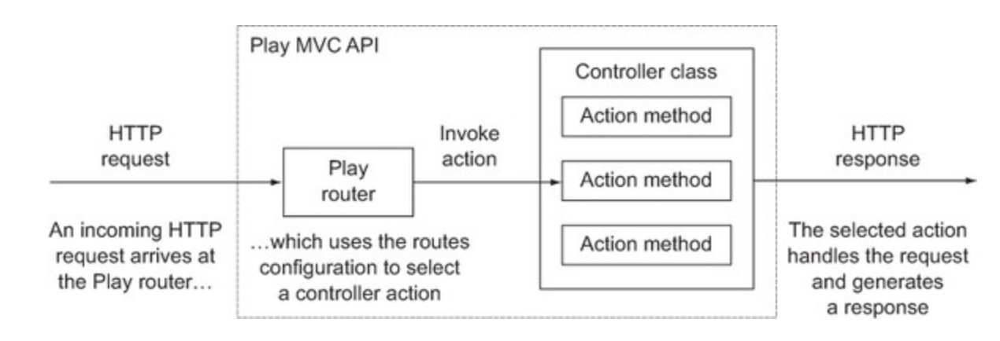
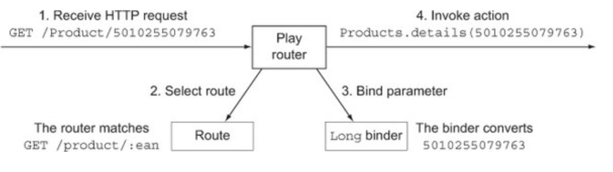
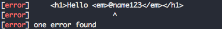

# Play For Scala - 2
이글은 Play 프레임워크를 활용하여 스칼라로 간단한 웹 어플리케이션을 작성하는 방법에 대하여 소개한 글 입니다.

## Controller

모두다 예상하셨겠지만, routes 파일에 입력한 URL은 스칼라 컨트롤러에 메서드들과 매핑됩니다.^^



 Play에서는 각 컨트롤러의 메서드를 특별히 'Action'이라고 부르고 그래서 Action Based MVC라고도 합니다.

 당연히 응답으로는 html , plain text , xml json 등을 지원 합니다.

 routes 파일은 아래와 같이 다양한 방법으로 작성이 가능 합니다.

 ```java
GET /                       controllers.Application.home()

GET /products               controllers.Products.list(page: Int ?= 1)

GET /product/:ean           controllers.Products.details(ean: Long)

GET /product/:ean/edit      controllers.Products.edit(ean: Long)

PUT /product/$ean<\d{13}>   controllers.Products.update(ean: Long)
```

Spring의 RequestMapping과 유사하네요^^ 컨트롤러에 직접 URL을 명시하는 방법과

별도의 파일로 분리하는 방식중 어떤게 더 좋을지...다른 분들의 생각이 궁금하네요^^


## Binding

쿼리스트링이나 URL Path로 전달된 값은 아래와 같은 방법으로 컨트롤러로 전달 됩니다.

(다들 예상하겠지만...)



1. HTTP 요청 수신
2. 컨트롤러 선택
3. 파라미터 바인딩
4. Action 메서드 호출

## Type-safe Template

Type-safe Template이란 무엇일까요..?^^ 결론부터 말씀드리자면..

Play에서는 Template에서 발생할 수 있는 오류가 런타임이 아닌 컴파일 타임에 발견 됩니다..??

아래 간단한 예제를 통해 알아보도록 하겠습니다. 

```html
@(name:Integer)
<!doctype html>
<html>
  <head>
    <meta charset="UTF-8">
    <title>Hello</title>
  </head>
  <body>
    <h1>Hello <em>@name123</em></h1>
  </body>
</html>
```

템플릿에 선언된 변수는 "@name" 이지만, 변수 접근시 이름을 "@name123"으로 값을 변경해 보았습니다.

"activiator start hello" 명령어를 실행하면 아래와 같이 컴파일 오류가 발생하면서,

서비스가 시작 되지 않습니다.

("activator run hello"로 하면 URL 호출 시 오류 발생)



우리가 주로 사용하는 JSP , Thymeleaf 같은 템플릿 엔진들과는 조금 다른 모습입니다.

Play는 서비스가 시작되기 전에 템플릿 코드들을 스칼라코드로 변경하기 때문에

컴파일 시점에 오류를 확인 할 수 있습니다. 런타임시에 발생 할 수 있는 오류들을

미리 방지 할 수 있다는 점에서는 Play의 장점 중 하나 인 것 같습니다.


## Avoid URL HardCoding

서비스를 개발하다 보면 URL을 하드코딩 해야 하는 경우가 발생합니다.

대표적으로는 Redirect와 Html A Tag의 href, 그리고 form에 submit URL등이 있습니다.

Play에서는 URL 하드코딩을 피할 수 있는 방법을 제공하는데요..한번 알아보도록 하겠습니다.

먼저 우리가 일반적으로 사용하는 방식으로 Redirect 해보도록 하겠습니다.

```scala
  def redirect = Action{
    Redirect("/hello?name=IM' Redirected")
  }
```

이번엔 조금 다른 방법으로 Redirect 시켜보겠습니다.

```scala
  def redirect = Action{
    Redirect(routes.HomeController.hello("A"))
  }
```

결과는 동일하지만 조금 더 명확해 보입니다^^. 잘못된 URL을 호출하는 경우도

컴파일 타임에 알아 낼 수가 있겠네요.

다음은 Html A Tag로 테스트 해보도록 하겠습니다.

hello 페이지로 이동하는 코드는 일반적으로 아래와 같이 href에 이동할 url을 적어줍니다.

```html
<!doctype html>
<html>
  <head>
    <meta charset="UTF-8">
    <title>Hello</title>
  </head>
  <body>
    <a href="/hello?name=HI">send me to hello</a>
  </body>
</html>
```

위 코드는 아래와 같이 수정 할 수 있습니다.

```html
<!doctype html>
<html>
  <head>
    <meta charset="UTF-8">
    <title>Hello</title>
  </head>
  <body>
    <a href='@controllers.routes.HomeController.hello("abc")'>send me to hello</a>
  </body>
</html>
```
Redirect와 마찬가지로..조금 더 명확하면서 컴파일 타임에 오류를 잡을 수 있습니다.

## SimpleDataBase

지금까지 Controller , View에 대해서 알아보았으니, 마지막으로 DB 연결에 대해 알아보겠습니다.

이번 예제에서는 Anorm이라는 라이브러리르 사용해 보도록 하겠습니다.

DB 연결을 위해서는 아래와 같은 몇가지 사전작업이 필요합니다.

### 1. DB 정보

사용할 DB 정보를 /conf/application.conf 파일에 등록합니다.

(activator create로 프로젝트를 만든 경우에는 주석으로 처리 되어있습니다.^^)

```
db {  
  default.driver = org.h2.Driver
  default.url = "jdbc:h2:mem:play"
}
```

### 2. Table 생성

어플리케이션 실행 시 자도응로 테이블을 생성 하도록 해보겠습니다.

1. build.sbt 파일에 "evolutions" 의존성을 추가 합니다.

```
libraryDependencies ++= Seq(
  jdbc,
  cache,
  ws,
  "org.scalatestplus.play" %% "scalatestplus-play" % "1.5.1" % Test,
  evolutions
)
```

2. /conf/evolutions/default 하위에 1.sql 파일을 생성하고 아래와 같이 작성합니다.

```sql
# --- !Ups
CREATE TABLE hello(
    id long,
    name varchar
)
```

3. 어플리케이션을 재시작 하고 연결해보면, sql 문을 실행할거냐고 물어보는 화면이 똭!!

조금더 자세힌 설명은 https://www.playframework.com/documentation/2.5.x/Evolutions을 참조하시면 될 것 같습니다.

### 3. Anorm

Model은 아래와 같이 간단하게 작성 해 보았습니다.


```scala
package models

case class Hello(id:Long , name:String)

object Hello{

import anorm._
import play.api.db.DB
import play.api.Play.current

    val sql: SqlQuery = SQL("select * from hello order by name asc")

    def getAll : List[Hello] = {
        DB.withConnection { implicit c =>
            sql().map(row => Hello(row[Long]("id") , row[String]("name"))).toList
        }
    }

    def addHello(hello:Hello) : Unit  = {
        DB.withConnection { implicit c =>
            SQL("insert into hello(id, name) values ({id}, {name})")
            .on('id -> hello.id, 'name -> hello.name).executeInsert()
        }     
    }

}
```

case class로 Hello를 만들고, object로 쿼리를 수행하는 함수들을

추가했습니다.

anorm을 사용할때는 위와같이 쿼리를 직접 작성해야 합니다.^^

지금까지 play를 활용해서 간단한 웹 어플리케이션을 작성해 보았습니다.