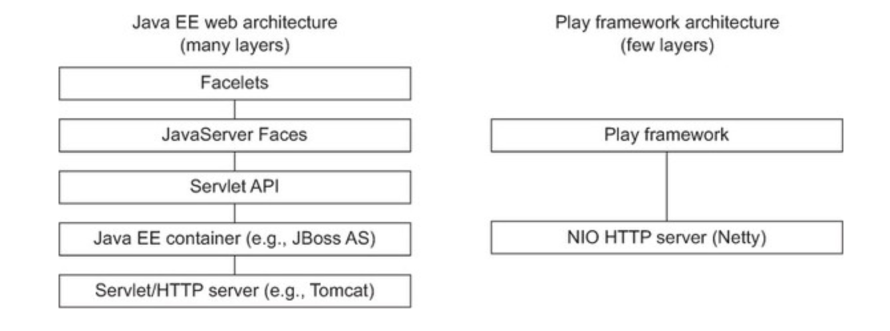
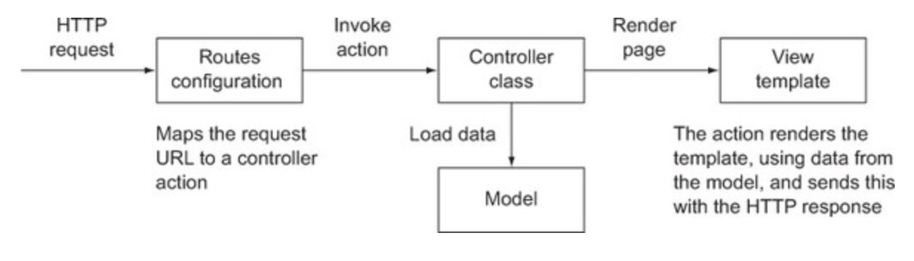

# Play For Scala - 1
이글은 Play 프레임워크를 활용하여 스칼라로 간단한 웹 어플리케이션을 작성하는 방법에 대하여 소개한 글 입니다.

## What Is Play

Play 프레임워크는 HTTP 요청을 간단하고,쉽고,유연하게 처리하는 방법을 제공하는 웹 프레임워크 

### 강점

Simplicity
- PHP 처럼 별도의 설정 없이 간단한 소스 개발 가능
- 별도의 WAS가 필요 없음

Productivity
- 재배포 없이 바로 적용 가능
- was에서 제공 해주기는 하지만 표준이 아님

Usability
- 생산성이 높음
- 개발자의 수준에 영향을 적게 받음

### 주요 특징
- Type-safe 매핑
- Type-safe 템플릿
- LiveCode Change

## J2EE VS Play


- J2EE 좋은 아이디어 이지만 복잡한 구조가 필요하기 때문에 복잡성이 증가
- JSP 같은 View Template을 사용 할 수 있지만 디버깅이 어려움

## Hello World
모든 예제의 기본인 Hello World 어플리케이션을 작성해 보도록 하겠습니다.

1. Play 사이트에서 Activator Download(https://www.playframework.com)
2. Path 설정(activator 명령 사용)
3. activator make hello(6 play for scala 선택)
4. hello 디렉토리로 이동
5. activator run hello
6. 9000 포트로 localhost 접속(http://localhost:9000)

여기까지 진행하면, 간단한 소개페이지를 확인 할 수 있습니다.

Tomcat을 설치하고 Path를 맞추는 작업보다 훨씬 간단하게 개발환경을 만들 수 있을것 같네요^^
(물론 SpringBoot도 가능 할 것 같습니다.^^)

마지막으로 한가지만 추가하면 Hello World를 볼 수 있습니다.!!

7. /hello/app/controllers에 HomeController.scala를 열어 아래와 같이 수정 합니다.

```scala
  def index = Action {
    Ok("Hello World")
  }
```

이렇게 헬로우 World 예제를 작성해 보았습니다. 사실 우리에겐 스프링부트가 있기 때문에,

아직까지는 크게 매력을 느끼지는 못할 것 같습니다. 하지만 IDE의 도움 없이

(사실 저는 vs code를 사용했습니다.)

Hello World를 볼 수 있다는 것은 조금 매력적인 것 같습니다.

## Hello World With Template

이번엔 Play에서 Template을 이용하는 방법을 알아보도록 하겠습니다.

/hello/views/hello.scala.html 파일을 생성하고 아래와 같이 작성합니다.

```html
@(name:String)
<!doctype html>
<html>
  <head>
    <meta charset="UTF-8">
    <title>Hello</title>
  </head>
  <body>
    <h1>Hello <em>@name</em></h1>
  </body>
</html>
```

그리고 /hello/app/controllers에 HomeController.scala 파일은 아래와 같이..

```scala
def hello(name:String) = Action {
    Ok(views.html.hello(name))
}
```

마지막으로, /hello/conf/route 파일은 아래와 같이 hello를 추가 합니다.
```java
GET /hello   controllers.HomeController.hello(name:String)
```

파라미터의 타입을 Int로 바꾸고, 숫자를 넘기지 않으면 어떻게 될까요?^^

테스트 해보시기 바랍니다.

Hello World가 실행된 순서를 대략적으로 살펴 보면 아래와 같습니다.



저희가 흔히 보던 그림이라..좀 식상하네요^^

지금까지 내용을 정리해보면 Play는 MVC 패턴으로 웹서비스를 만드는 보다 간단한 방법을 제공한다..

라고 정리할 수 있을 것 같습니다.

다음번에는 좀 더 자세히 알아보도록 하겠습니다. 