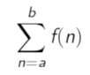

# Linear Recursion VS Tail Recursion

이 글은 스칼라를 통한 재귀함수의 구현 방법과 Recursive 함수의 종류에 대해서 설명합니다.

## Factorial을 간단하게..
1부터 3까지 더하는 Recursive 함수를 작성하면..
[source , javascript]
def sumInts(a:Int , b:Int) : Int = {
  if(a > b) 0 else a + sumInts(a +1 , b)
}

1부터 3까지 3제곱한 수 더하는 Recursive 함수를 작성하면..
[source , javascript]
def cube(x : Int) : Int = x*x*x
def sumCube(a:Int , b:Int) : Int = {
  if(a > b) 0 else cube(a) + sumInts(a +1 , b);
}

뭔가 중복 코드의 냄새가..

기억 나십니까..Factorial..

소스로 옮겨보면..이런 모습입니다.

[source , javascript]
def sumFactorials(a:Int , b:Int) : Int = {
  if(a > b) 0 else f(a) + sumFactorials(a +1 , b);
}

스칼라 함수는 일급함수!! , 파라미터로 함수를 넘겨보자..

[source , javascript]
def sum( f:Int => Int , a:Int , b:Int) : Int = {
  if(a > b) 0 else f(a) + sum(f , a +1 , b)
}

f라는 함수와 숫자 a , b를 파라미터로 받는 함수 id와 cube를 선언 후 sum의 파라미터로 사용..

[source , javascript]
def id(n:Int) : Int = n
def cube(x : Int) : Int = x*x*x
def newSumInts(a:Int , b:Int) = sum(id , a , b)
def newSumCube(a:Int , b:Int)  = sum(cube , a , b)

이것을 익명함수(Anonymous Function)으로 바꾸면..
[source , javascript]
def anonySumInts(a:Int , b:Int) = sum( x => x ,a , b)
def anonySumCube(a:Int , b:Int) = sum( x => x * x * x ,a , b)

조금 더 어려운 이야기가 곧 시작됩니다.

## Factorial을 복잡하게..

위에서 사용한 방법은 Linear Recursion

call -> call -> call -> call -> call ....

return <- return <- return <- return <- return <- .....

조건이 맞을때 까지(재귀함수 탈줄 조건) call 하다가 return 하는 구조..

Recursive 함수의 단점은??

a 와 b 숫자의 차이가 큰 경우 stack overflow가 발생 할수 있다..

어떻하지...

대안은 Tail Recursive..뭔지..??

개발자는 소스부터..

[source , javascript]
def tailSum( f:Int => Int , a:Int , b:Int) :Int  ={
    def loop(a:Int , acc:Int) : Int = {
      if(a > b) acc
      else loop(a + 1 , f(a) + acc)
    }
    loop(a , 0)
}

다시한번..스칼라 함수는 일급함수!! 함수는 변수처럼..함수안에서 또다시 선언 가능..

그런데 ... 똑같은 Recursive 아닌가..??

약간의 차이가 있습니다..

첫번째 Recursive 함수는 return 된 값들을 + 하면서 함수를 빠져 나옵니다..

[source , javascript]
if(a > b) 0
else f(a) + sum(f , a +1 , b)

f함수(cube or id) 함수의 결과 더하기 sum 함수의 호출결과를 더한 값을 return!!

두번째 Recursive 함수는 최종적으로 더해진 값을 return!!

[source , javascript]
if(a > b) acc
else loop(a + 1 , f(a) + acc)

즉, Recursive의 탈출조건에 맞는 경우 return 되는 값이 최종값!!

그래도..그놈이나..이놈이나..Recursive 함수 아닌가..??

맞습니다. You're Right!!

But...

스칼라는 Tail Recursive한 함수는 반복문으로 변환해서 컴파일을 수행합니다.

이상 스칼라의 Factorial의 구현 방법과 재귀함수의 종류에 대한 이야기 였습니다.

결론은... 가능하면 Tail Recursive 함수를 작성하여 스칼라 컴파일러가 loop문으로

변경 할 수 있는 기회를 주는 것이 좋을것 같습니다

..가능하다면..가능하다면..
