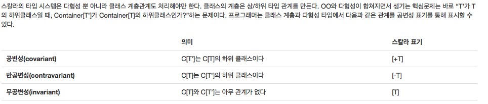

# Type Bounds & Covariant

이글은 스칼라의 Type Bounds와 Covariant에 대해서 설명하는 글이며, coursera의 스칼라 프로그래밍 강의를 참조하여 작성하였습니다.

## Type Bounds
자바의 제너릭과 비슷하면서도 다른 개념이 스칼라에도 있습니다.

예를들어, IntSet이라는 추상클래스 밑에 Empty , NotEmpty라는 클래스가 있다고 가정합니다.

그리고 Empty를 파라미터로 받고 Empty를 리턴하는 , NotEmpty를 파라미터로 받고 NotEmpty를

리턴하는 함수를 선언 해보겠습니다.(개발자는 소스부터...)

```scala

abstract class IntSet{

}

class Empty extends IntSet{

}

class NotEmpty extends IntSet{

}

object IntSet{
  def asserInfoSet[S <: IntSet](a:S) : S = a

}
```

```scala
val e = new Empty

e: Empty = Empty@7d61eb55

val b:Empty = IntSet.asserInfoSet(e)

b: Empty = Empty@7d61eb55

val c:NotEmpty = IntSet.asserInfoSet(e)
/*
error: type mismatch;
found   : Empty
required: NotEmpty
      val c:NotEmpty = IntSet.asserInfoSet(e)
                                           ^
*/
```


assertInfoSet 함수를 보면 "[S <: IntSet]" 이런 선언을 확인 할 수 있습니다.

이것은 Java 제너릭 [T extends IntSet]의 의미와 동일합니다.

즉, 파라미터로 IntSet을 상속받은 객체를 파라미터로 받고 동일한 객체를 리턴하라는 의미입니다.

이것을 Upper Bound라고 부릅니다.

 "S <: T"는 S가 T의 SubType 이라는 것을 표시합니다.
 "S >: T"는 T가 S의 SubType , S가 T의 Super Type이라는 것을 표시합니다.

이제 NotEmpty를 상속받은 ChildNotEmpty 클래스를 만들어 보겠습니다.

그리고 ChildNotEmpty의 Super Type만 전달 받도록 아래와 같이 함수를 선언 합니다.

```scala

class ChildNotEmpty extends NotEmpty{

}

def assertInfoSet2[S >: ChildNotEmpty](a:S) : S = a

```

이것을 Lower Bound라고 부릅니다.

그리고 아래와 같이 테스트 해보았습니다.

```scala
val empty:Empty = new Empty

empty: Empty = Empty@1ab06251

val empty2:Empty = IntSet.assertInfoSet2(empty)

error: type mismatch;
 found   : IntSet
 required: Empty
       val empty2:Empty = IntSet.assertInfoSet2(empty)
```

예상대로 Empty는 ChildNotEmpty의 Super Type이 아니기 때문에 오류가 발생합니다.

그런데... 오류 메세지가 조금 이상합니다.

ChildNotEmpty의 Super Type이 아니라서 오류가 난 것이 아니라,

IntSet이 아니어서 오류가 발생했습니다.

그럼 아래와 같이 함수의 리턴을 IntSet 객체로 받아보도록 하겠습니다.

```scala
val empty2 : IntSet  = IntSet.assertInfoSet2(empty)
empty2: IntSet = Empty@1ab06251
```

상황을 종합해보면...

Empty 클래스는 ChildNotEmpty의 부모 클래스는 아닙니다.

하지만 Empty는 IntSet의 SubType이고, IntSet은 ChildNotEmpty 클래스의 SuperType이기 때문에

오류가 발생하지 않는 것입니다. 그럼 아래와 같은 코드는 어떻게 될까요...

```scala
val s :String = new String

val s2 = IntSet.assertInfoSet2(s)
```

역시 오류가 나지 않습니다.

String 클래스는 스칼라의 최상위 객체인 Any의 SubType 이고,

ChildNotEmpty 역시 Any의 SubType이기 때문에.. 오류가 발생하지 않습니다.

그럼 이런 필요없는 Lower Bound 왜 만들었을까요..??

```scala
def assertInfoSet3[S >: ChildNotEmpty <: IntSet](a:S) : S = a
```

이것은 Mixed Bounds...

Lower Bound와 Upper Bound를 조합하여 위와 같이 선언 할 수 있습니다.

```scala
val s2 = IntSet.assertInfoSet3(s)
:12: error: inferred type arguments [Object] do not conform to method assertInfoSet3's type parameter bounds [S >: ChildNotEmpty <: IntSet]
       val s2 = IntSet.assertInfoSet3(s)
                       ^
:12: error: type mismatch;
 found   : String
 required: S
       val s2 = IntSet.assertInfoSet3(s)
```

이제 String을 변수로 넘기면 위와 같은 오류가 발생되게 됩니다.^^

지금까지 스칼라의  Bound에 대한 설명이었습니다.


## Covariant

Covariant를 네이버 사전으로 찾아보면..공변하는..이라는 의미로 나옵니다.

왜 이런 단어가 스칼라에서 사용 되는지 한번 확인해 보도록 하겠습니다.

위의 글에서 NotEmpty는 IntSet의 SubType임을 확인하였습니다.

그럼 아래와 같은 관계도 성립하는 걸까요..??

```scala
List[NotEmpty] <: List[IntSet]
```

결론부터 말하자면..NO!!

우리에게 친숙한 Java 코드로...바꿔 보겠습니다.

```java
public class T {
    abstract class IntSet{

    }

    class Empty extends IntSet{

    }

    class NotEmpty extends IntSet{

    }


    public void test(){
        NotEmpty[] a = new NotEmpty[]{new NotEmpty()};
        IntSet[] b = a;
        b[0] = new Empty();
        NotEmpty bb = a[0];
    }
}
```

Java가 확실히 눈에 잘 들어오네요...( 스칼라 그만 할까.... )

위의 코드는 어디서 오류가 발생할까요.?? 컴파일 오류?? 런타임 오류??

"b[0] = new Empty();" 코드에서 런타임 오류가 발생합니다.

Java 배열의 경우 위에서 말한 관계가 성립합니다.

"IntSet[] b = a;"가 오류가 발생하지 않기 때문이죠...

NotEmpty가 Empty를 상속하고 있고, 이 관계가 자바의 배열에까지 전달 됐다고 할 수 있습니다.

위에서..Covariant의 뜻이..공변이라고 했죠..?^^

뭔가 같이 변하는 느낌이 드시나요 ~~

위의 코드를 스칼라 코드로 옮기면 아래와 같습니다.

```scala
val ar1 : Array[NotEmpty] = Array(new NotEmpty)
val b:Array[IntSet] = ar1
b(0) = new Empty
val s:NotEmpty = ar1(0)
```
Java 배열은 Scala에서는 Array로 사용합니다.

위의 코드는 어디서 오류가 날까요..? 컴파일 오류?? 런타임 오류??

2번째 라인인 "val b:Array[IntSet] = ar1" 에서 오류가 발생합니다.

왜냐하면..scala의 Array는 Covariant하지 않기 때문입니다.^^

그럼 공변성 클래스는 어떻게 만들까요..??

스칼라 스쿨에서는 아래와 같이 정의 하고 있습니다.
(https://twitter.github.io/scala_school/ko/type-basics.html)



...

...

...

(개발자는 소스부터..)
```scala
class Invariant[T] {

}

object Invariant{
  def apply[T](a : T) : Invariant[T] =  new Invariant
}


val ar1 : Covariant[NotEmpty] = Covariant(new NotEmpty)
val ar2 : Covariant[IntSet] = ar1 /*컴파일 오류*/


class Covariant[+T] {

}

object Covariant{
  def apply[T](a : T) : Covariant[T] =  new Covariant
}

val ar1 : Covariant[NotEmpty] = Covariant(new NotEmpty)
val ar2 : Covariant[IntSet] = ar1 /*컴파일 성공*/

```

Invariant 클래스는 무공변성으로 선언되었습니다. 즉 정확히 같은 타입의 경우에만 허용이 됩니다.

Covariant 클래스는 공변성으로 선언되었습니다. IntSet이 NotEmpty의 상위클래스인 경우 허용 됩니다.

스칼라학교의 글로 해석해보면...

Container['T] = Covariant[NotEmpty] , Container[T] = Covariant[IntSet]

C['T]는 C[T]의 하위 클래스이다.(OK!!)


무공변성은 공변성의 반대가 성립되는 경우 입니다.

```scala
class Contravariant[-T] {

}

object Contravariant{
  def apply[T](a : T) : Contravariant[T] =  new Contravariant
}


val ar3: Contravariant[String] = new Contravariant[AnyRef]
val ar4: Contravariant[AnyRef] = new Contravariant[String] /*컴파일 오류*/
```

지금까지 스칼라의 Type Bounds와 Covariant에 대해서 알아보았습니다.
